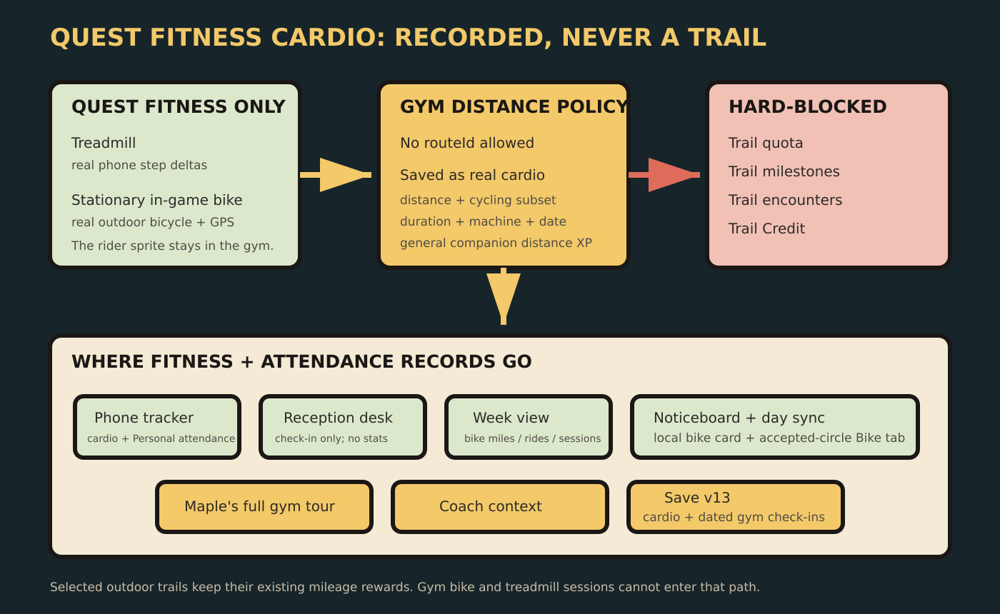
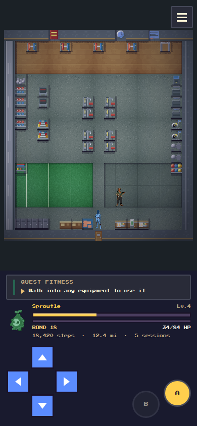
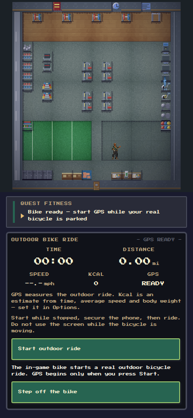
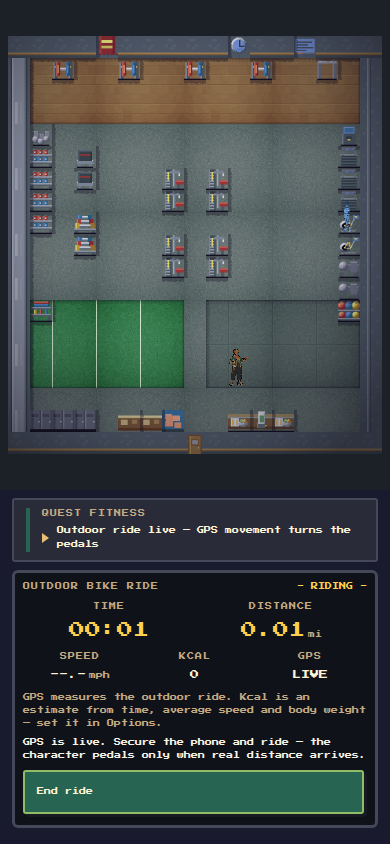
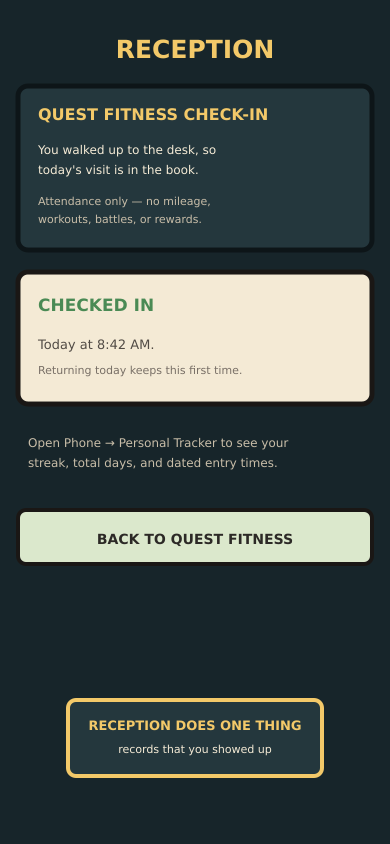
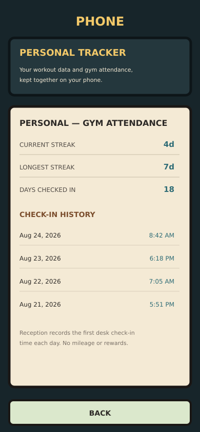
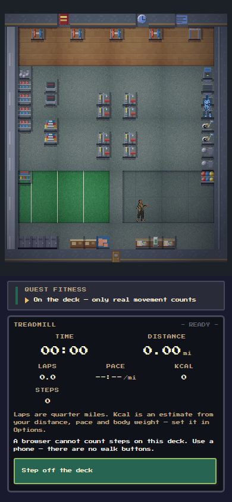

# Quest Fitness cardio upgrades

Quest Fitness now has a complete cardio line along its east wall: three
treadmills, two stationary bikes, and two rowers. The equipment remains the
interface — walk into a machine to use it — and Coach Maple's full-floor tour
now stops at the bikes and explains what crosses into the real world.

## Outdoor bicycle rides

The bike in the gym is stationary; the player rides a real moving bicycle
outside. Stepping onto the in-game bike opens a dedicated ride console. The
player starts GPS while parked, secures the phone, rides, then ends the session
only after stopping again.

Once GPS is live, distance updates the console and the character pedals only
when a real location delta arrives. The console reports elapsed time, measured
distance, average speed, GPS state, and a clearly labelled calorie estimate.

Ride miles remain real cardio and can still pay general distance XP, but they
never receive a trail id, fill a trail quota, move a trail milestone meter,
roll an encounter, or mint Trail Credit. They are recorded separately as
cycling miles and completed bike rides in the Phone, Week and the
noticeboard's local/accepted-circle Bike board.

Completed bike, treadmill and rower sessions also enter a bounded recent-cardio
log with machine, date, duration and mileage. Existing saves keep all lifetime
totals and begin that session-level list empty rather than inventing detail.
Reception is deliberately separate: walking into its desk records attendance
only. Its date/time, streak and total-day history appear in the Phone's Personal
Tracker and never become cardio mileage or rewards.

## Treadmills

Treadmills keep using the phone's real step source. The player walk/run frames
animate only while step deltas arrive, so a stationary phone never makes the
character run. The browser development build can show its existing step
injector for QA; release builds and the bike never expose manual distance.

The same save migration adds `cyclingMi` and `ridesDone` without inventing
history for existing players. Save v12 adds the bounded cardio-session log.
Cycling speed/MET calculations, trail/credit isolation, noticeboard sync and
old-save migration paths have deterministic checks in `tools/`.
