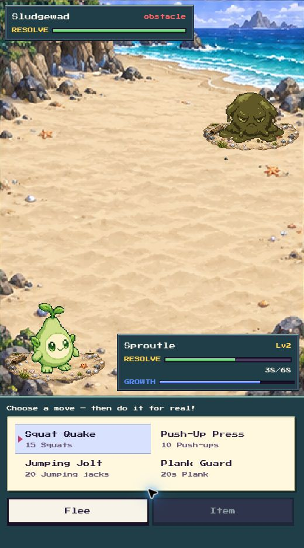
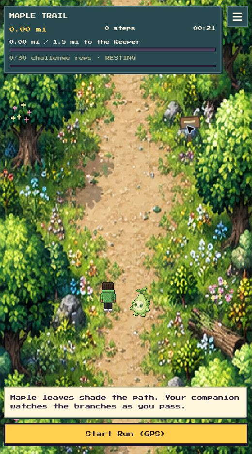
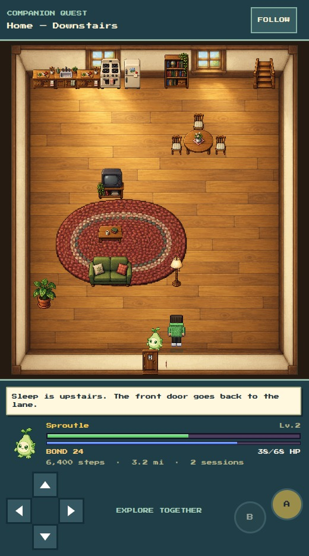
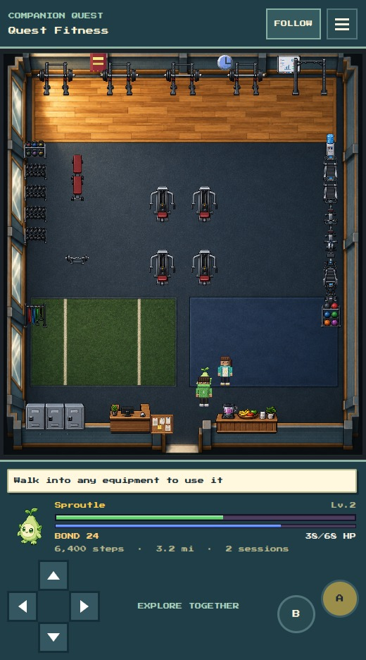
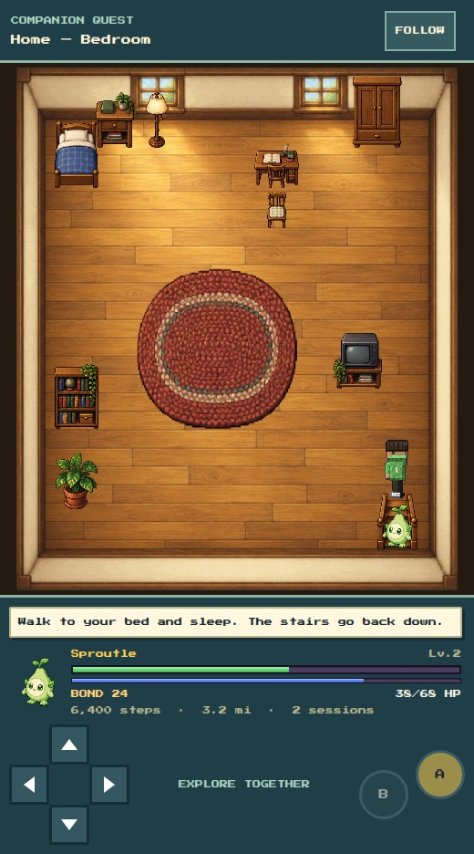

# Connected-world gameplay overhaul

Sunkist Lane, the home and Quest Fitness now use continuous landscapes or architectural floors. Furniture and gym equipment are independently positioned from the interaction map, with contact shadows and depth ordering. The collision grid remains invisible. Trails and encounters use twelve matching biome families with connected ground. The trail HUD and battle controls leave more room for the scene.

The sprite renderer draws 282 existing traced sprites as complete PNG sheets, preserving authored palettes, aspect ratios and idle frames. This improves rendering; it does not claim 282 new character designs.

## Actual in-game screenshots

Captured from real Expo web screens using an isolated development fixture. The fixture and preview save namespace are excluded from the production web bundle.

## Verification

- Walked into the house and returned to its matching doorstep; checked the pond-side bench and Stillness return.
- Traversed the stairs in both directions and entered/exited a treadmill. No movement correctly produced zero credits and nothing to save.
- Checked trail save-and-return and battle move selection/cancel.
- All 21 commands from the repository test script passed individually, including lint, docs, art, client rules, server auth and friends. Lint has 11 existing hook warnings, zero errors.
- Sprite/audio regeneration reproduced tracked output.
- Final Android export: 1171 modules. Final web export: 912 modules. Both succeeded.
- Physical-phone pedometer/GPS, native touch, performance and sign-in remain unverified.

## Asset provenance and maintenance

Original raster assets were created with the built-in image generation tool. Direction: richly shaded late-1990s handheld RPG art, consistent top-down perspective, connected materials without checkerboard ground, dimensional objects and contact shadows. No franchise characters or UI are baked into scenes.

- `sunkist-lane-v2.png`: continuous grass and sandy paths, red cottage, blue fitness hall, pond, bench, garden and tree border, using the previous gameplay layout as a spatial reference.
- `home-floor-v2.png`: empty warm plank floor, cream perimeter walls and two north windows; furniture remains independent.
- `quest-fitness-floor-v2.png`: empty rubber floor, wooden north lifting deck, lower turf and mat areas, mirrors and perimeter walls.
- `home-furniture-v2.png`: transparent 4-by-5 atlas of kitchen, living-room, bedroom and stair furniture.
- `gym-equipment-v2.png`: transparent 4-by-5 atlas of gym machines, racks, weights and service furniture.
- `trail-environments-v2.png`: 3-by-4 atlas of continuous forest, earth, grassland, shade, coast, marsh, snow, cave, ember, autumn, storm and moonlit trails.
- `battle-environments-v2.png`: corresponding 3-by-4 encounter clearings, with open space for separate combatant sprites.

`SceneProps` crops original RGBA atlases using source alpha bounds in `propBounds.js`; pixels are not rewritten. `worldArt.js` selects room floors. `environmentArt.js` selects biome panels. Existing interaction codes remain authoritative. The old tile atlas remains available for fallback art.

## Placement, travel and regional platforms follow-up

Downstairs now groups kitchen counters on the north wall, dining furniture northeast, and the sofa/coffee table/TV around a southwest rug. The eastern aisle and entry remain clear. Upstairs the bedside lamp/nightstand and desk/chair form usable groups, with storage and a smaller central rug.

Moved downstairs codes: `a`, `m`, `v`, `x`, `f`, `l`, `p`, `o`; upstairs: `k`, `m`, `o`, `v`, `l`, `p`. Doors, stairs and the bed trigger retain their coordinates. All codes have atlas renderers. The new reachability test checks every usable station and both floors' exits; the two bed codes represent one object. Browser checks covered the desk, dining table, return positions and stairs in both directions.

Trail scenery now tracks accumulated measured distance instead of a repeating timer. No distance means no travel, including when GPS is enabled. Foreground details and inspectable trail markers use a separate travel depth; markers reveal regional observations without awarding progress. The player faces along the trail. Reduced motion snaps scenery to the new distance. A disposable development input of 0.05 miles moved the scene and marker; later paused scenery pixels matched exactly. No real fitness session was created.

Battle platforms use twelve original transparent terrain patches, selected with the same biome index as the trail and clearing. Rill maps to coastal sand and Gale to open meadow. The gym uses a training mat.

All 22 repository test commands passed individually, including the new placement/travel suite. Native sensor cadence and performance still need a phone.

## September 11: proportions and companion arrivals

Individual furniture and equipment now retain their source proportions within their existing footprints, anchored at the floor. Continuous locker/counter runs and rugs still fill their designated areas. No interaction or collision code moved.

Companions choose a free neighboring tile when the space behind the player is blocked. Room identity includes dimensions so the two home floors reset the follower correctly, while NPC-filtered gym maps do not reset it on every step. A small stationary contact shadow grounds the breathing companion.

Fresh captures from the actual Expo web development fixture:

Verification for this follow-up:
- All client suites in `npm test`, art validation, and server syntax passed. Final follower suite: `10 passed, 0 failed`, covering 2,232 arrival placements.
- Final lint: `0 errors, 11 warnings` (existing hook warnings). Documentation: all 42 figures agree.
- Sprite and audio regeneration left tracked generated assets unchanged.
- Walked from the home entrance to the bedroom and back downstairs using the actual movement controls. Checked the follower remained visible after turning in the gym.
- Final exports: `Web Bundled 2345ms index.js (915 modules)`, `Android Bundled 6652ms index.js (1167 modules)`, `iOS Bundled 10820ms index.js (1175 modules)`.
- Auth/friends integration tests could not run: the fresh workspace could not build the pinned better-sqlite3 native dependency under Node 24 (header extraction failed with `EINVAL: invalid argument, fchown`). This is not a passing full `npm test` run.
- The browser also reported an existing QR-worker CDN import failure; QR scanning was not verified. Native sensors, touch/performance and sign-in remain unverified.
