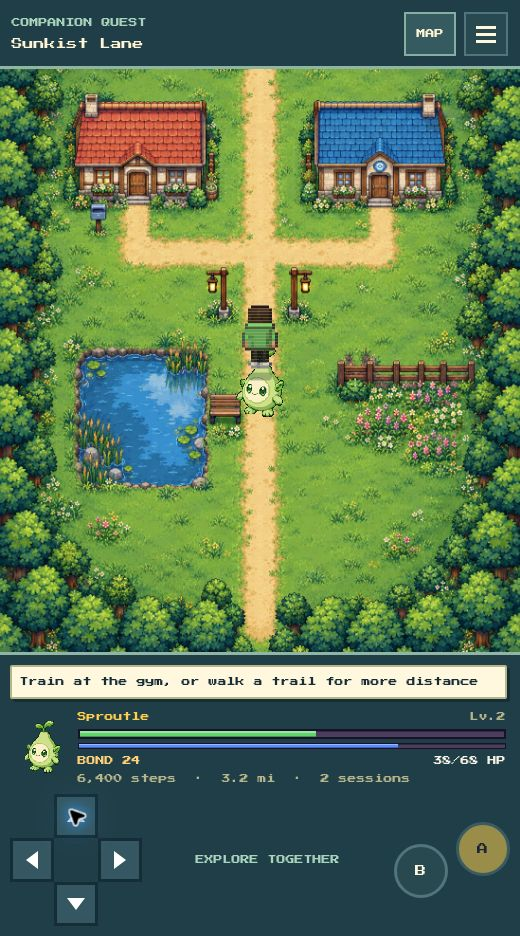
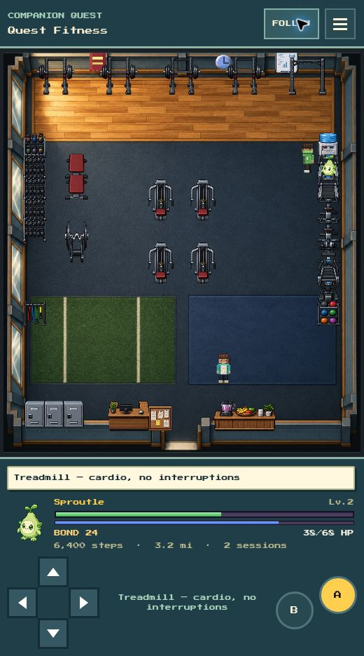
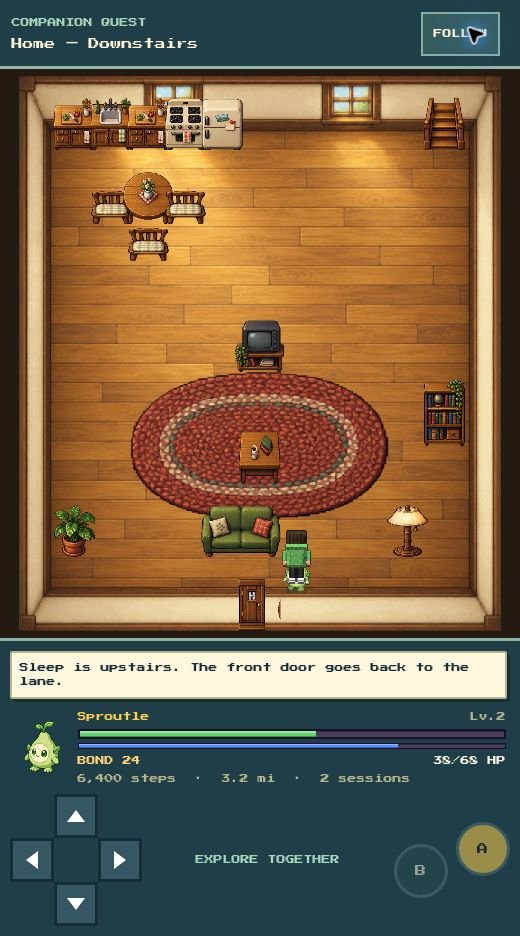
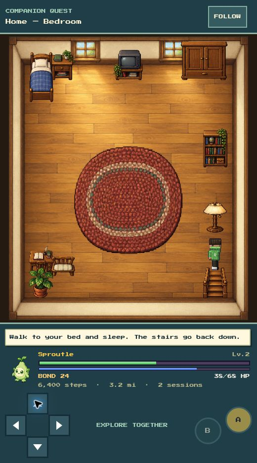
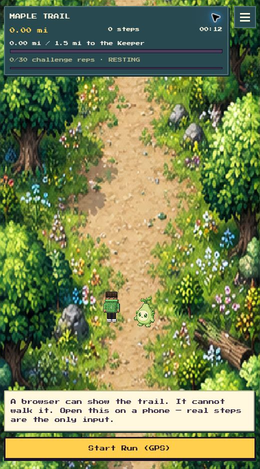
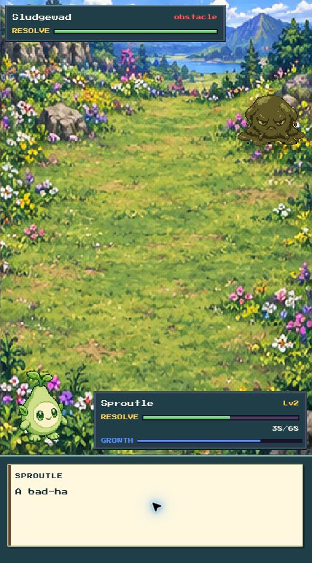

# Connected-world gameplay overhaul

Sunkist Lane, the home and Quest Fitness now use continuous landscapes or architectural floors. Furniture and gym equipment are independently positioned from the interaction map, with contact shadows and depth ordering. The collision grid remains invisible. Trails and encounters use twelve matching biome families with connected ground. The trail HUD and battle controls leave more room for the scene.

The sprite renderer draws 282 existing traced sprites as complete PNG sheets, preserving authored palettes, aspect ratios and idle frames. This improves rendering; it does not claim 282 new character designs.

## Actual in-game screenshots

Captured from real Expo web screens using an isolated development fixture. The fixture and preview save namespace are excluded from the production web bundle.

## Verification

- Walked into the house and returned to its matching doorstep; checked the pond-side bench and Stillness return.
- Traversed the stairs in both directions and entered/exited a treadmill. No movement correctly produced zero credits and nothing to save.
- Checked trail save-and-return and battle move selection/cancel.
- All 21 commands from the repository test script passed individually, including lint, docs, art, client rules, server auth and friends. Lint has 11 existing hook warnings, zero errors.
- Sprite/audio regeneration reproduced tracked output.
- Final Android export: 1171 modules. Final web export: 912 modules. Both succeeded.
- Physical-phone pedometer/GPS, native touch, performance and sign-in remain unverified.

## Asset provenance and maintenance

Original raster assets were created with the built-in image generation tool. Direction: richly shaded late-1990s handheld RPG art, consistent top-down perspective, connected materials without checkerboard ground, dimensional objects and contact shadows. No franchise characters or UI are baked into scenes.

- `sunkist-lane-v2.png`: continuous grass and sandy paths, red cottage, blue fitness hall, pond, bench, garden and tree border, using the previous gameplay layout as a spatial reference.
- `home-floor-v2.png`: empty warm plank floor, cream perimeter walls and two north windows; furniture remains independent.
- `quest-fitness-floor-v2.png`: empty rubber floor, wooden north lifting deck, lower turf and mat areas, mirrors and perimeter walls.
- `home-furniture-v2.png`: transparent 4-by-5 atlas of kitchen, living-room, bedroom and stair furniture.
- `gym-equipment-v2.png`: transparent 4-by-5 atlas of gym machines, racks, weights and service furniture.
- `trail-environments-v2.png`: 3-by-4 atlas of continuous forest, earth, grassland, shade, coast, marsh, snow, cave, ember, autumn, storm and moonlit trails.
- `battle-environments-v2.png`: corresponding 3-by-4 encounter clearings, with open space for separate combatant sprites.

`SceneProps` crops original RGBA atlases using source alpha bounds in `propBounds.js`; pixels are not rewritten. `worldArt.js` selects room floors. `environmentArt.js` selects biome panels. Existing interaction codes remain authoritative. The old tile atlas remains available for fallback art.
